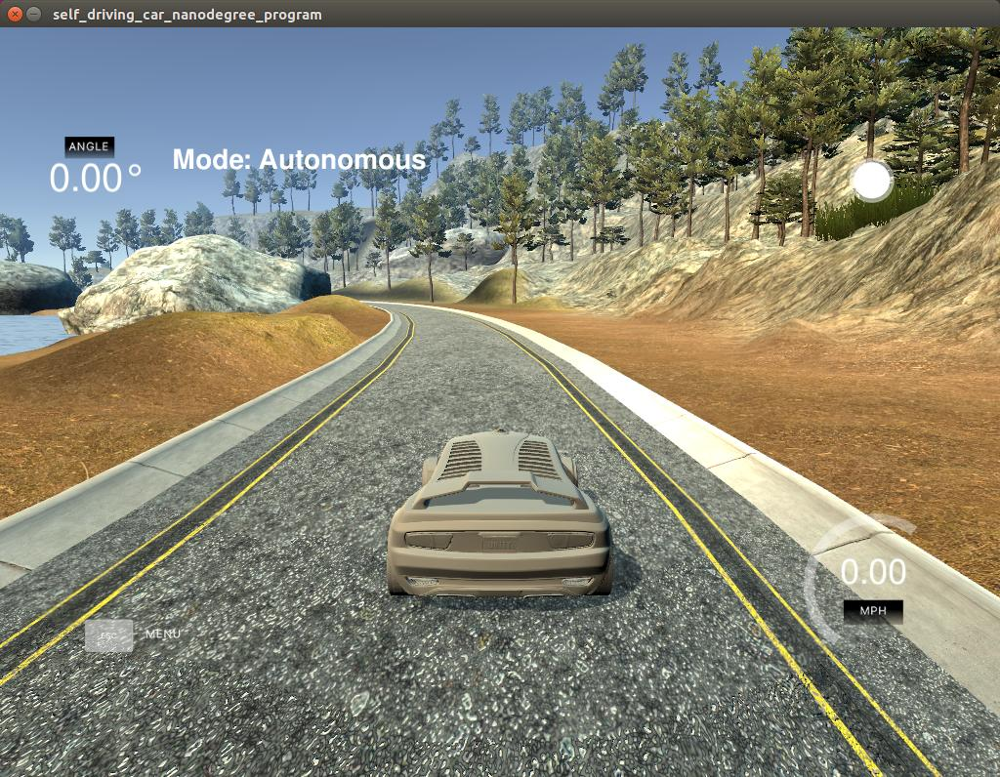

# CarND-Controls-PID
Self-Driving Car Engineer Nanodegree Program

---

This project implements a PID Controller. A simulator is provided by Udacity ([it could be downloaded here](https://github.com/udacity/self-driving-car-sim/releases)). This simulator will generate CTE (Cross Track Error) using [WebSocket](https://en.wikipedia.org/wiki/WebSocket). Udacity provides a seed project to start from on this project ([here](https://github.com/udacity/CarND-PID-Control-Project)).

This project involves the Term 2 Simulator which can be downloaded [here](https://github.com/udacity/self-driving-car-sim/releases)

## How to compile and run: 

    Perform steps following:

    - Clone this repos
    - Make build directory: **mkdir build && cd build**
    - Compile the code: **cmake .. && make**
    - Run the code: **./pid **
    - Start and run Project 4 : PID Controller of Self Driving Car Simulator

## Result

## Method of the PID parameters tuning

I using manual PID parameters tuning. Based on the table shown below.

| Closed-loop Response | Rise Time | Overshoot | Settling time | Steady State Error |
| -------------------- | --------- | --------- | ------------- | ------------------ |
| P increase | Decrease | Increase | Small change | Decreases |
| I increase | Decrease | Increase | Increase | Eliminate |
| D increase | Small change | decrease | decrease | Small change |

## Low Pass Filter

I also used a [low pass filter library](https://github.com/overlord1123/LowPassFilter). It help to smooth out the PID control output and make the car drive more smoother.
